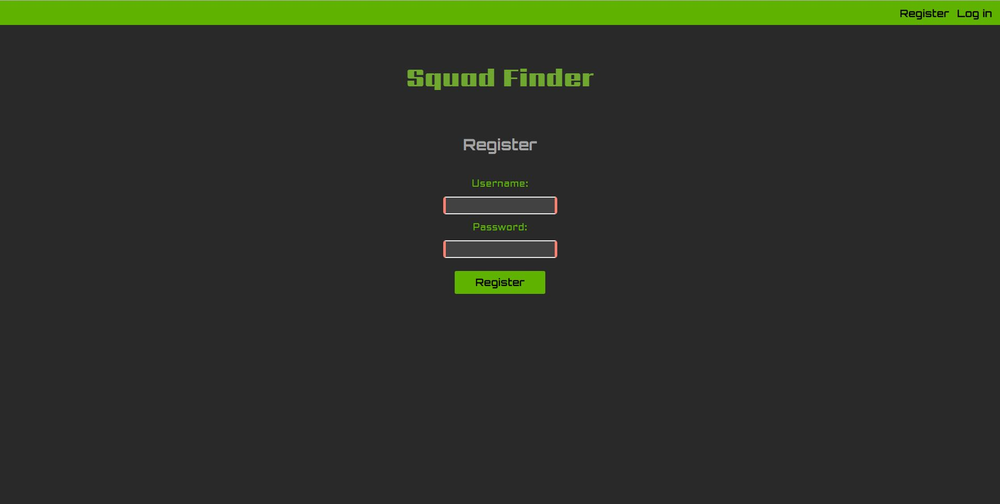

# Squad Finder
## Live Demo
https://squad-finder.yougene42193.now.sh/
## Summary
Squad Finder helps battle royal players to find other players to group with. Users can create an account so they can put their profile into the list of other players. User can view the list and can filter out which games they play, platform and region to make it easier to find the right player for them.
## Screenshots
### Landing Page

### Registration

### Login

### Create Profile

### Profiles List

## API Documentation
The API can be found at https://github.com/yougene42193/squad-finder-server/
### /users 
* POST / creates a new user with a username and password. Verifies if the username is already taken and if the password fulfills the requirements.
### /profiles
* GET / gets all of the profiles that have been created by the users.
* POST / creates a new profile with the requirements of username, platform, game and region. Then lists that profile into the list.
## Built With
* React
* CSS
* NodeJS
